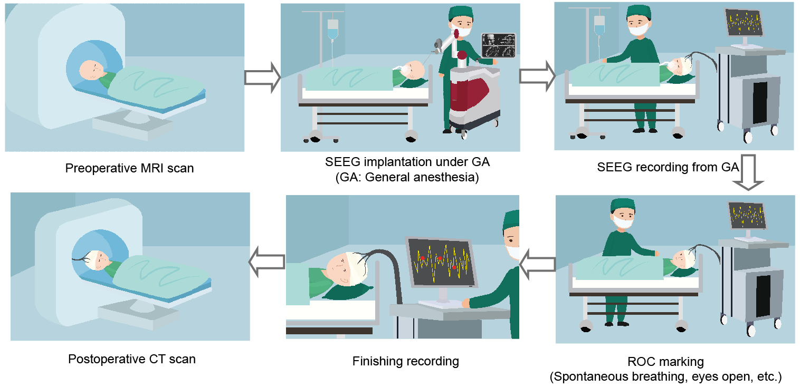
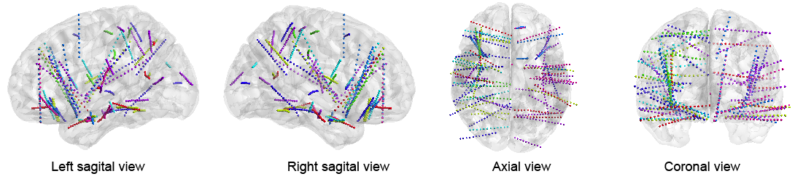
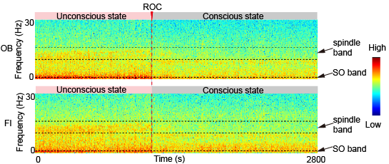
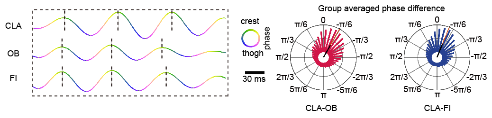
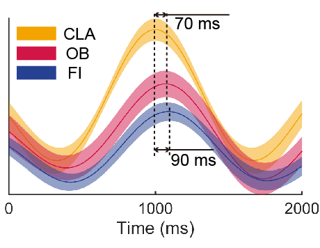

# Mapping brain dynamics in anesthesia-induced unconsciousness with a human stereoelectroencephalography resource

Understanding how different brain regions coordinate with each other during consciousness switches is an important step towards the comprehensive deciphering of the human consciousness. Electrophysiological signals, as widely used indicators of brain activities, provide a good measurement to monitor the brain dynamics in various consciousness statuses. 

Here, we modified the stereoelectroencephalography (SEEG) device to enable the record of multichannel intracranial signals of 44 subjects under the anesthesia-induced consciousness switches. For each subject, the SEEG signals were sensed with ~100 intracranial electrode channels (localized by preoperative MRI and postoperative CT), sampled at milliseconds temporary resolution, and annotated with accurate consciousness states from synchronized videos.

> Raw and processed data are available from OpenNeuro database with accession number [ds003754](https://openneuro.org/datasets/ds003754).


This repository contains functions and results reproducibility code in the paper. 


> Citation: 
> 
> Sen Wan\*, Feng Bao\*, Chen Yao\*, Fengpeng Wang, Bohan Li, Shi Mao, Wendi Yu, Kexin Zhang, Youyong Kong, Xiaobin Zhang, Xiaoping Du, Xiaodong Cai, Lu Fang, Yue Deng, Yi Yao and Qionghai Dai. Mapping brain dynamics in anesthesia-induced unconsciousness with a human stereoelectroencephalography. 2021 under submission.




Figure 1: An overview of experiments. 

## Tools used in the analyses

MATLAB R2020a

[FieldTrip-20191213](https://www.fieldtriptoolbox.org/)

[generalized-phase](https://github.com/mullerlab/generalized-phase)

[CircHist](https://github.com/zifredder/CircHist)

[Cline2](https://www.mathworks.com/matlabcentral/fileexchange/14677-cline)

[CircStat](https://github.com/circstat/circstat-matlab)

[wave](https://github.com/mullerlab/wave-matlab)

[smoothn.m](https://www.mathworks.com/matlabcentral/fileexchange/25634-smoothn)

[PTE-variants](https://github.com/angelikipapana/PTE-variants)

[SPM12](https://www.fil.ion.ucl.ac.uk/spm/software/spm12/)

[PACmeg](https://github.com/neurofractal/PACmeg)

[Brainnet Viewer](https://www.nitrc.org/projects/bnv/)

## Installation

Download or clone the repository:

```bash
git clone https://github.com/thuwansen/SEEG_analysis_code
```

Then add the code and dependencies on the MATLAB path, and you will be able to run the demonstrations in this repository.

## Usage

### Data preparation

All data were from Xiamen Humanity Hospital and were approved to be de-identified and shared. All data in this dataset have no identifiers associated with the patient. The data were publicly available at: https://openneuro.org/datasets/ds003754.


### Reproduce results in the manuscript

Four main functions are included in the code. Each of the functions reproduces the results corresponding to each main figure in the article. Each main function contains one initial code section to add the global variables and dependencies and some code sections for the subfigures. 

1. `Fig1_main.m`

Initial code section

```Matlab
% Code for Fig1
clc,clear,close all;
addpath('xxx\toolbox\fieldtrip-20191213');
addpath(genpath('xxx\toolbox\nature_walk_wave'));
addpath('xxx\toolbox\BrainNetViewer_20191031')
code_path = 'xxx\code\functions';
addpath(genpath(codepath);
run([code_path,'\Global_variable_define_LOC2ROC.m']);
fs =500;
color_group = [243/255,164/255,0/255;
               209/255,21/255,71/255;
               39/255,65/255,146/255];
```

Example code section for Fig. 1c

	
```Matlab
Fig1c_path = [savepath,'\Fig1c'];
if ~exist(Fig1c_path)
    mkdir(Fig1c_path);
end
all_subjects_coordinate = [];
for idx =1:length(subs_name)
    if ~isempty(SEEG_coordinate_path{idx,1})
        tmp_coordinate = load(SEEG_coordinate_path{idx,1});   
        tmp_mni = tmp_coordinate.SEEG_COORDINATE.MNI_coordinate;
        [chan_num,~]=size(tmp_mni);
        final_coordinate = zeros(chan_num,6);
        final_coordinate(:,1:3)=tmp_mni;
        final_coordinate(:,4)=idx;
        final_coordinate(:,5)=idx;
        final_coordinate(:,6)=idx;
        all_subjects_coordinate=[all_subjects_coordinate; final_coordinate];
    end
end
save([Fig1c_path,'/all_subjects_coordinate.node'], 'all_subjects_coordinate','-ascii');
```



2. `Fig2_main.m`




3. `Fig3_main.m`



4. `Fig4_main.m`



## Copyright

Software provided under MIT License.

Permission is hereby granted, free of charge, to any person obtaining a copy of this software and associated documentation files (the "Software"), to deal in the Software without restriction, including without limitation the rights to use, copy, modify, merge, publish, distribute, sublicense, and/or sell copies of the Software, and to permit persons to whom the Software is furnished to do so, subject to the following conditions:

The above copyright notice and this permission notice shall be included in all copies or substantial portions of the Software.

THE SOFTWARE IS PROVIDED "AS IS", WITHOUT WARRANTY OF ANY KIND, EXPRESS OR IMPLIED, INCLUDING BUT NOT LIMITED TO THE WARRANTIES OF MERCHANTABILITY, FITNESS FOR A PARTICULAR PURPOSE AND NONINFRINGEMENT. IN NO EVENT SHALL THE AUTHORS OR COPYRIGHT HOLDERS BE LIABLE FOR ANY CLAIM, DAMAGES OR OTHER LIABILITY, WHETHER IN AN ACTION OF CONTRACT, TORT OR OTHERWISE, ARISING FROM, OUT OF OR IN CONNECTION WITH THE SOFTWARE OR THE USE OR OTHER DEALINGS IN THE SOFTWARE.
